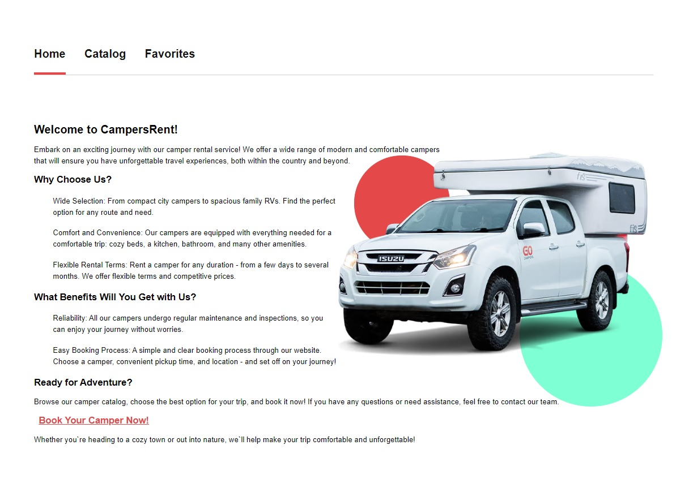
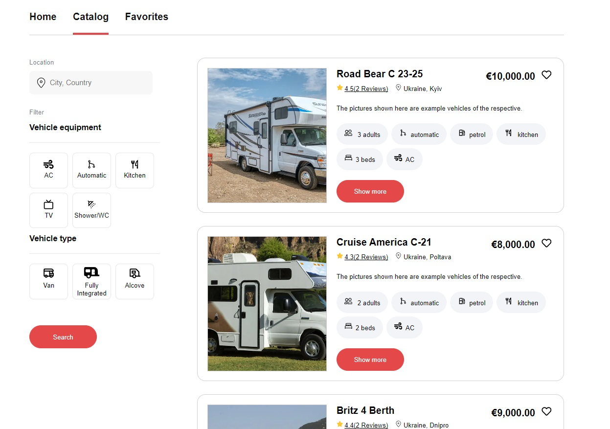
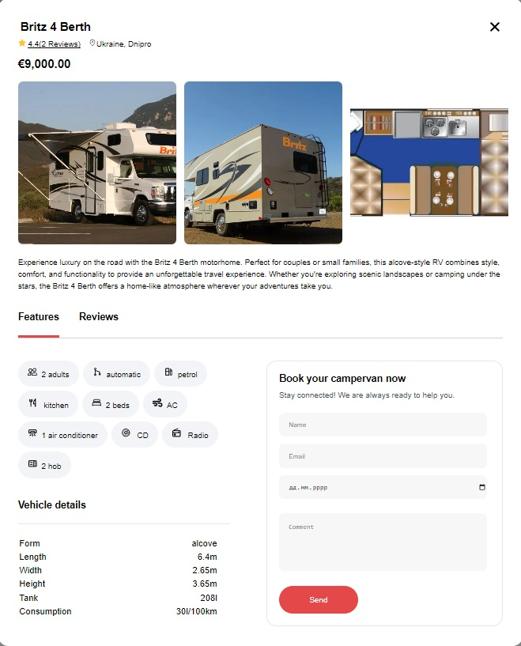
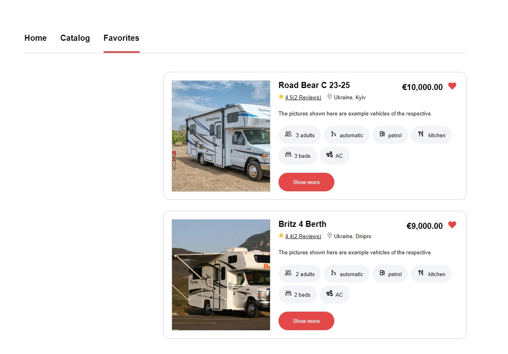

# <a id="campersRent" style="color:black">CampersRent</a>

##### Application built with React + Vite for comfortable rent camper with easy way

##### Table of contents

- [About The Project](#aboutProject)
- [Build Technologi](#buildTechnologi)
- [Pages](#pages)
  - [Home](#pageHome)
  - [Catalog](#pageCatalog)
    - [Modal](#modal)
  - [Favorite](#pageFavorite)
- [Loading Project](#loadingProject)

---

#### <a id="aboutProject" style="color:black">About The Project</a>

This a simple web application for renting campers. find your dream camper with us!

[Top](#campersRent)

---

#### <a id="buildTechnologi" style="color:black">Build Technologi</a>

JS, React, CSS, Vite, Vercel

[Top](#campersRent)

---

#### <a id="pages" style="color:black">Pages</a>

This web application has navigation on 3 pages: Home, Catalog, Favorite. Which we will consider in more detail below.

[Top](#campersRent)

---

##### <a id="pageHome" style="color:black">Pages Home</a>

The main page that we see when entering the site for the first time. Contains basic information for the user



[Top](#campersRent)

---

##### <a id="pageCatalog" style="color:black">Pages Catalog</a>

A page that has basic user interaction logic. The page has an easy-to-understand interface and basic information. There is also filtering to make it easier to find the right campers.



[Top](#campersRent)

---

##### <a id="modal" style="color:black">Modal</a>

when you click _show more_, a modal window appears with all information about the camper, user comments and a convenient form for ordering the camper of your choice



[Top](#campersRent)

---

##### <a id="pageFavorite" style="color:black">Pages Favorite</a>

There is also an opportunity to select your favorite camper, which will be displayed on this page for ease of selection



[Top](#campersRent)

---

#### <a id="loadingProject" style="color:black">Loading Project</a>

To run the project you need to enter in the console.

###### For download libraries Windows:

```html
npm instal
```

###### Start:

```html
npm run dev
```

[Top](#campersRent)
